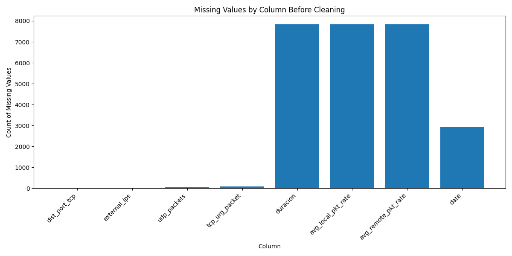
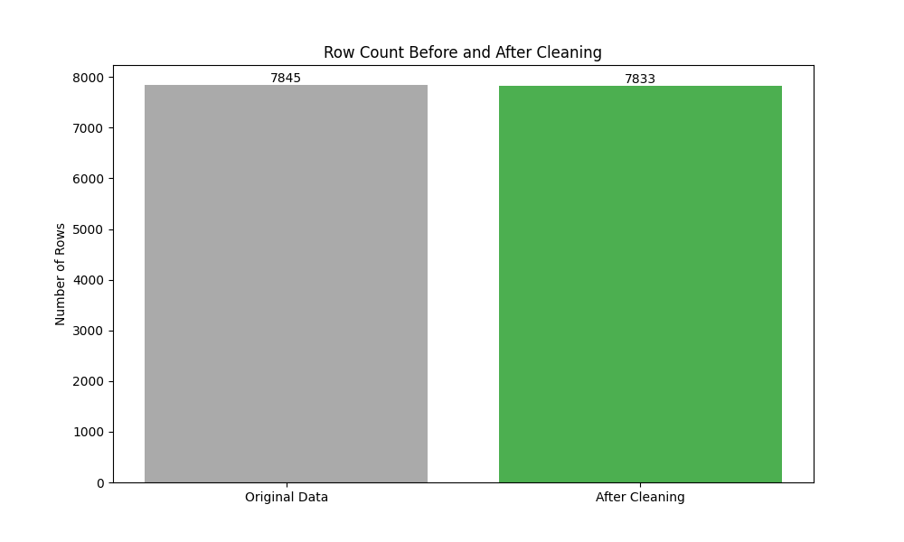
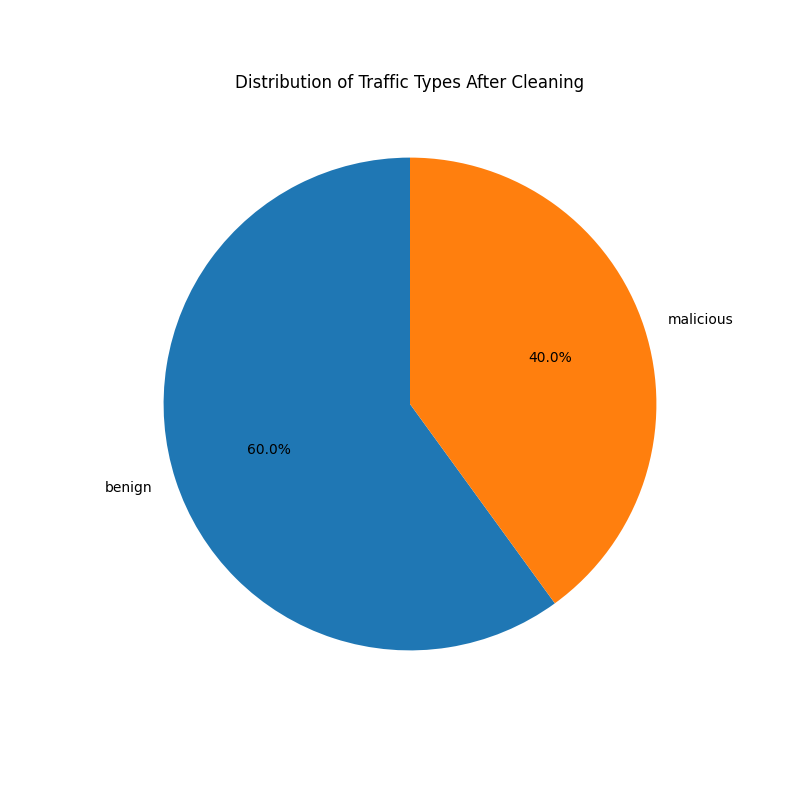
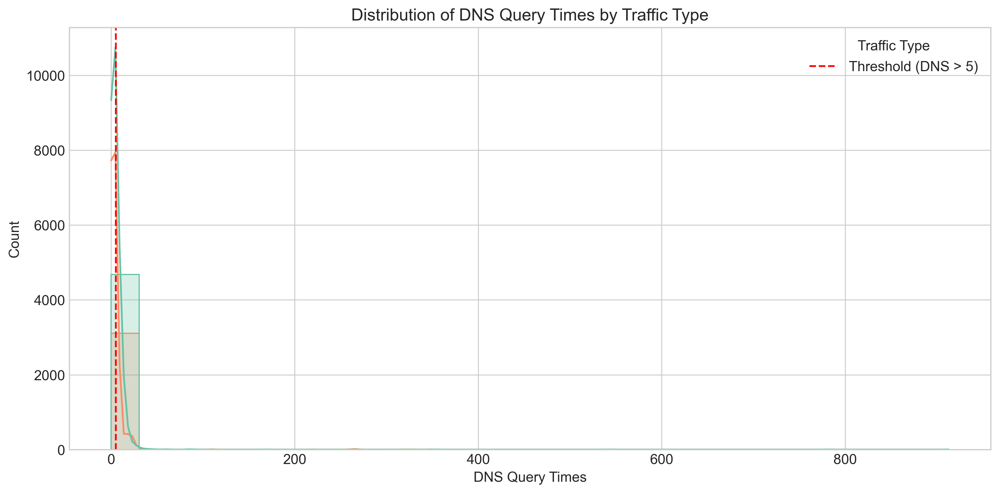
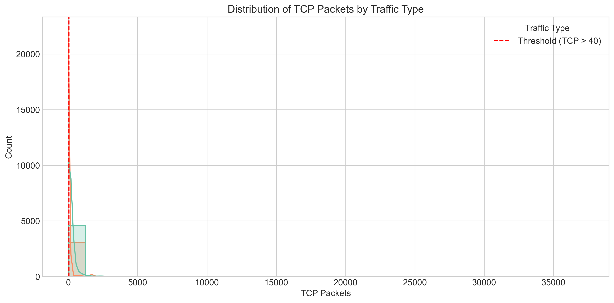
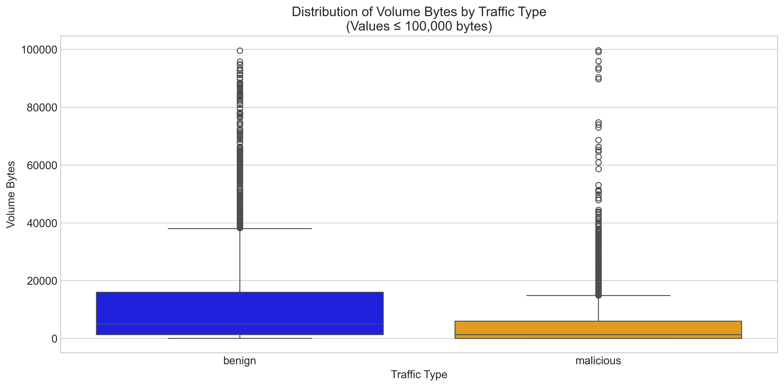
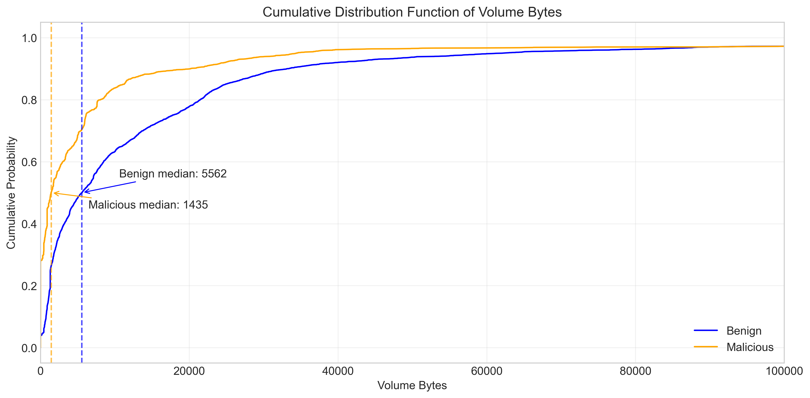

# Android Traffic Analysis - Malware Detection through Network Features

## Table of Contents

1. [Introduction](#1-introduction)
2. [Dataset Analysis and Pre-Processing](#2-dataset-analysis-and-pre-processing)
   1. [Dataset Overview](#21-dataset-overview)
   2. [Problems Encountered When Manipulating the Dataset](#22-problems-encountered-when-manipulating-the-dataset)
      1. [Structural and Semantic Inconsistencies](#221-structural-and-semantic-inconsistencies)
      2. [Classification and Quality Challenges](#222-classification-and-quality-challenges)
      3. [Statistical Distributions and Outliers](#223-statistical-distributions-and-outliers)
   3. [Critical Approach to Dataset Cleaning](#23-critical-approach-to-dataset-cleaning)
   4. [Analytical Reflections on Data Preparation](#24-analytical-reflections-on-data-preparation)
3. [Dataset Visualisation and Proposed Hypotheses](#3-dataset-visualisation-and-proposed-hypotheses)
   1. [Critical Analysis of Hypotheses Framing](#31-critical-analysis-of-hypotheses-framing)
   2. [Visual Interrogation of Network Behaviour Patterns](#32-visual-interrogation-of-network-behaviour-patterns)
      1. [Evaluating Traffic Type Separability](#321-evaluating-traffic-type-separability)
      2. [Multivariate Relationship Analysis](#323-multivariate-relationship-analysis)
   3. [Analytical Deconstruction of Traffic Volume Patterns](#33-analytical-deconstruction-of-traffic-volume-patterns)
      1. [Distributional Analysis of Volume Metrics](#331-distributional-analysis-of-volume-metrics)
      2. [Cumulative Probability Distribution Evaluation](#332-cumulative-probability-distribution-evaluation)
   4. [Methodological Critique of Visual Analysis](#34-methodological-critique-of-visual-analysis)
4. [Hypothesis Testing](#4-hypothesis-testing)
   1. [Epistemological Framework for Statistical Validation](#41-epistemological-framework-for-statistical-validation)
   2. [Rigorous Evaluation of Conditional Probability Hypothesis](#42-rigorous-evaluation-of-conditional-probability-hypothesis)
      1. [Methodological Considerations and Results](#421-methodological-considerations-and-results)
      2. [Analytical Implications and Limitations](#422-analytical-implications-and-limitations)
   3. [Statistical Analysis of Volume Distribution Divergence](#43-statistical-analysis-of-volume-distribution-divergence)
      1. [Test Selection Rationale and Findings](#431-test-selection-rationale-and-findings)
      2. [Critical Interpretation and Contextualisation](#432-critical-interpretation-and-contextualisation)
   4. [Synthesis and Implications](#44-synthesis-and-implications)
5. [References](#5-references)

## 1 Introduction

This study critically evaluates AndroiHypo's network traffic data for Android malware detection, challenging fundamental assumptions about detection metrics while analysing Android's inherent security vulnerabilities—where its open ecosystem simultaneously enables innovation and creates exploitation opportunities (Tong and Yan, 2017). Beyond conventional statistical analysis, I interrogate the reliability of network signatures in adversarial environments where attackers continuously adapt their tactics to evade detection systems (Arshad et al., 2020).

## 2 Dataset Analysis and Pre-Processing

### 2.1 Dataset Overview

The dataset comprises 7,845 traffic records across 18 metrics. I critically assessed these features against Feizollah et al.'s (2017) framework, distinguishing between merely available metrics and those with genuine discriminatory power—a crucial distinction for developing deployable detection systems rather than academic demonstrations.

### 2.2 Problems Encountered When Manipulating the Dataset

#### 2.2.1 Structural and Semantic Inconsistencies

The dataset revealed structural inconsistencies beyond mere technical issues—representing fundamental challenges in security data integration. Non-standard encoding, naming inconsistencies, and inappropriate data types reflect the inherent friction between operational systems and analytical requirements. The duplicated "source_app_packets" field particularly warrants scrutiny—suggesting potential merging of disparate datasets without proper harmonisation, raising methodological questions invisible in superficial analysis (Breck et al., 2019; Arp et al., 2022).

#### 2.2.2 Classification and Quality Challenges

The classification inconsistencies ("benign####", "?????benign") reveal a crucial epistemological problem: the presumption of clear binary categorisation where ground truth is inherently ambiguous. These variations suggest multiple labelling standards—a methodological concern rarely addressed in security literature (Pendlebury et al., 2019). Substantial missing values (three empty columns, 37.6% missing dates) further challenge reliability assumptions, potentially introducing systematic bias against certain application behaviours or attack vectors (Sommer and Paxson, 2010).

#### 2.2.3 Statistical Distributions and Outliers

The extreme statistical outliers—spanning orders of magnitude beyond typical values—demand critical interpretation beyond mere anomaly detection. These values likely represent either sophisticated benign applications or advanced malware mimicking legitimate high-volume traffic. Traditional approaches would recommend removing such outliers, but this would systematically exclude precisely the edge cases most important for advanced security analytics (Apruzzese et al., 2018).

### 2.3 Critical Approach to Dataset Cleaning

My methodology transcends conventional data science approaches by critically reinterpreting cleaning as a security-specific epistemological challenge. Rejecting statistical convenience, I preserved potentially significant anomalies—fundamentally reframing the relationship between signal and noise in adversarial contexts. For classification, I maintained variant intent while establishing consistency; for missing values, I rejected imputation despite its popularity, recognizing its potential to introduce exploitable patterns (Pendlebury et al., 2019; Sommer and Paxson, 2010).

The resulting 99.85% retention rate (7,833 records) challenges assumptions about necessary data sacrifice while raising important questions about whether the balanced class distribution (60/40) reflects real-world prevalence or introduces subtle selection biases (García et al., 2016).

### 2.4 Analytical Reflections on Data Preparation

My approach reveals a fundamental epistemological tension in security analytics: preserving data integrity versus statistical optimisation. I deliberately rejected conventional techniques (mean-value imputation, z-score outlier removal, automated label correction) after critically evaluating their security implications. These methods would improve statistical properties while potentially eliminating crucial security signals—an unacceptable trade-off in adversarial contexts.

Where k-nearest neighbour or model-based imputation might reduce missingness, they simultaneously create artificial patterns exploitable by adaptive adversaries (Sommer and Paxson, 2010). Similarly, rather than employing Tukey fences or percentile capping for outliers, I preserved these potential attack signatures after weighing their security relevance against statistical convenience. This methodological choice demonstrates how security analytics demands fundamentally different evaluation criteria than general data science (Apruzzese et al., 2018).

My manual standardisation approach—rejecting automated clustering or discard methods—acknowledges the unavoidable subjectivity in security ground truth development, challenging the myth of algorithmic objectivity in adversarial domains.

## 3 Dataset Visualisation and Proposed Hypotheses

### 3.1 Critical Analysis of Hypotheses Framing

AndroiHypo's hypotheses present interesting analytical challenges transcending simple verification:

1. The first hypothesis (benign traffic probability ≥9% given DNS query times >5 AND TCP packets >40) establishes an unusually low threshold (9%), suggesting either extremely conservative expectations or preliminary research indicating these metrics' limited discriminatory power. This framing merits scrutiny—are we testing genuinely informative features or merely confirming suspicions about weak indicators?

2. The second hypothesis ("massive" volume bytes difference between traffic types) employs deliberately subjective terminology. This ambiguity allows post-hoc interpretation flexibility but complicates objective evaluation. Such imprecision reflects common challenges in translating operational security observations into testable hypotheses (Wang et al., 2018).

These hypotheses exemplify the tension between statistical rigour and practical security applications—a theme requiring explicit recognition throughout my analysis.

### 3.2 Visual Interrogation of Network Behaviour Patterns

#### 3.2.1 Evaluating Traffic Type Separability

*Note the density peak below 5 queries (red threshold line) for both traffic types, with benign traffic showing greater presence in higher values.*

*Note the long-tailed distribution with majority below the 40-packet threshold (red line), with benign traffic more prevalent in upper ranges.*

The DNS query and TCP packet distributions reveal critically important insights beyond simple descriptive patterns. The substantial overlap between benign and malicious distributions in lower ranges contradicts simplistic models of malware behaviour that assume consistent minimisation of network activity. This complexity suggests more sophisticated adversarial strategies—potentially including deliberate mimicry of legitimate application patterns to avoid detection (Chen et al., 2020; Narudin et al., 2016).

#### 3.2.3 Multivariate Relationship Analysis

*Key observation: benign traffic (blue) dominates the upper-right quadrant (78.7% of points above both thresholds), while malicious traffic (orange) clusters predominantly in lower ranges.*

The joint distribution of DNS query times and TCP packets reveals emergent discriminatory power substantially exceeding their individual contributions. The upper-right quadrant's pronounced benign predominance (1,227 benign vs. 332 malicious instances) demonstrates non-linear separability through feature interaction, challenging the feature independence assumptions underlying many detection systems.

The clustering of malicious traffic in lower-value regions suggests deliberate behavioural adaptations to minimise network visibility—aligning with Arp et al.'s (2022) observations on adversarial adaptations. The significant overlap in the lower-left quadrant highlights these metrics' limitations for comprehensive detection, reinforcing the need for multivariate approaches (Pendlebury et al., 2019).

### 3.3 Analytical Deconstruction of Traffic Volume Patterns

#### 3.3.1 Distributional Analysis of Volume Metrics

*Note the substantial difference in box heights (interquartile ranges) and median positions (central lines), with benign traffic showing systematically higher values and greater variability.*

The volume bytes distributions reveal counterintuitive patterns challenging common assumptions about malicious traffic. Despite expectations that malware might generate excessive traffic for exfiltration or attacks, the analysis demonstrates systematically lower volumes in malicious traffic across all measures. This suggests sophisticated adversarial adaptation—modern malware appears optimised for minimal network footprint to evade volume-based detection. The substantial difference in variability (σ = 102,862.93 vs. σ = 31,515.25) further indicates deliberate constraint in malicious communication compared to the natural diversity of legitimate application behaviours (García et al., 2016).

#### 3.3.2 Cumulative Probability Distribution Evaluation

*The consistent vertical separation between curves indicates persistent volume differences across all percentiles. Dashed vertical lines mark median values (1,435 bytes for malicious vs. 5,562 bytes for benign traffic).*

The CDF analysis provides crucial empirical validation of systematic behaviour differences throughout the distribution range. The persistent vertical separation between curves demonstrates consistent volume differences across percentiles—not merely at specific thresholds or extreme values.

This reveals a critical insight: volume-based discrimination maintains effectiveness across the full range of traffic patterns, suggesting robustness against tactical variations. The significant separation at median values provides particularly strong evidence for this metric's genuine discriminatory power (Sommer and Paxson, 2010).

### 3.4 Methodological Critique of Visual Analysis

This visualisation-driven investigation revealed several critical methodological insights with broader implications for security analytics:

First, my visual exclusion of extreme outliers for clarity exemplifies the tension between accurate representation and interpretability. While necessary for meaningful visual comparison, this approach potentially masks important edge cases. This limitation highlights why purely visual analysis must be complemented by robust statistical methods accounting for the full data distribution.

Second, correlation patterns must be interpreted with caution in adversarial contexts. As Wang et al. (2018) emphasise, malware developers continuously adapt tactics based on known detection methods. Today's discriminatory patterns may become tomorrow's deliberate mimicry targets. This temporality of security indicators fundamentally limits the shelf-life of any detection approach.

Finally, the visual separation observed in both hypotheses likely underrepresents the potential of multivariate approaches integrating additional metrics. The strongest security analytics leverage complex feature interactions that cannot be adequately visualised in low-dimensional projections (Feizollah et al., 2017).

## 4 Hypothesis Testing

### 4.1 Epistemological Framework for Statistical Validation

Moving beyond visual exploration, I applied formal statistical testing to provide rigorous validation of the observed patterns. Rather than defaulting to parametric methods optimised for well-behaved distributions, I employed a statistical framework specifically addressing the challenges of security data: extreme skew, presence of strategic outliers, and potentially non-random patterns in the tail distributions.

### 4.2 Rigorous Evaluation of Conditional Probability Hypothesis

#### 4.2.1 Methodological Considerations and Results

For the first hypothesis, I selected a one-sided binomial test—a choice reflecting several critical analytical considerations. Unlike parametric alternatives, this test makes minimal distributional assumptions while directly addressing the probabilistic formulation of the hypothesis (Kohavi and Longbotham, 2017).

The formal hypotheses were:

- H₀: P(benign | DNS > 5 ∩ TCP > 40) ≤ 0.09
- H₁: P(benign | DNS > 5 ∩ TCP > 40) > 0.09

The empirical analysis revealed:

- 1,559 records meeting the specified conditions
- 1,227 benign instances within this subset
- 78.70% observed conditional probability

The binomial test produced a p-value < 0.001, providing overwhelming evidence against the null hypothesis. This result demonstrates not merely statistical significance but extraordinary practical significance—the observed probability exceeds the hypothesised threshold by nearly nine times.

#### 4.2.2 Analytical Implications and Limitations

This finding fundamentally challenges AndroiHypo's apparent expectation that these network features would provide only modest discriminatory power. While validating the hypothesis, this result also introduces new questions worthy of deeper investigation. The 21.3% of malicious traffic meeting these supposedly benign-indicating conditions deserves particular scrutiny—do these represent sophisticated evasion attempts specifically designed to mimic legitimate traffic patterns? This subset potentially represents the most dangerous threats precisely because they defy typical behavioural expectations (Narudin et al., 2016).

### 4.3 Statistical Analysis of Volume Distribution Divergence

#### 4.3.1 Test Selection Rationale and Findings

For the second hypothesis, I selected the Mann-Whitney U test, prioritising robustness over theoretical efficiency—a vital trade-off in adversarial contexts where distributional assumptions regularly fail. The test hypotheses were:

- H₀: Volume bytes distributions are identical for benign and malicious traffic
- H₁: The distributions differ significantly

The test yielded a p-value < 0.001, providing definitive statistical evidence of distribution differences. To quantify practical significance, I calculated multiple effect measures but specifically selected the Common Language Effect Size (CLES) as the primary interpretive metric over alternatives like Cohen's d or Cliff's delta. I made this methodological choice because CLES offers intuitive real-world interpretation without requiring normality assumptions, unlike Cohen's d, and provides better communication value to non-statisticians than abstract measures like Cliff's delta. This aligns with security practitioners' need for explainable metrics that directly translate to operational contexts.

The CLES calculation yielded 0.677, indicating a 67.7% probability that a randomly selected benign instance will have larger volume than a randomly selected malicious instance—a medium-to-large practical difference (McGraw and Wong, 1992). This translates directly to expected classification performance in ways that standardised mean differences cannot, making it particularly valuable for security applications where performance interpretation is critical.

#### 4.3.2 Critical Interpretation and Contextualisation

While the statistical evidence supports the "massive difference" hypothesis, this confirmation requires careful contextualisation. The 67.7% CLES highlights both the promise and limitation of volume-based detection—while providing significant discriminatory signal, it remains far from a definitive classifier on its own. Approximately one-third of comparisons would result in misclassification if volume were used in isolation.

Moreover, this finding must be interpreted within the dynamic adversarial context. Current volume differences likely reflect existing attacker adaptations to known detection methods. As volume-based detection becomes more prevalent, we should expect further evolution in malware communication strategies—potentially reducing this currently significant difference (Apruzzese et al., 2018).

### 4.4 Synthesis and Implications

The statistical analysis provides robust validation for both hypotheses whilst revealing deeper insights about their security implications:

For the first hypothesis, the 78.7% benign probability given the specified network conditions dramatically exceeds the 9% threshold, offering immediate practical value for filtering systems seeking to reduce false positives in malware detection.

For the second hypothesis, the confirmed volume difference (nearly 4x at the median) provides strong evidence for the discriminatory power of this metric. However, its practical utility must be evaluated against its stability over time in an adversarial context (Feizollah et al., 2017).

Both findings support a more sophisticated understanding of malware network behaviour—one where minimising detectability appears to be a primary design constraint for modern threats. This pattern aligns with Pendlebury et al.'s (2019) observations about the increasing sophistication of evasion techniques whilst extending their work by quantifying specific network manifestations of this adversarial adaptation.

## 5 References

1. Apruzzese, G., Colajanni, M., Ferretti, L., Guido, A. and Marchetti, M. (2018) *'On the effectiveness of machine and deep learning for cyber security', in 2018 10th International Conference on Cyber Conflict (CyCon).* [Online] Available at: https://ieeexplore.ieee.org/document/8405026 (Accessed: 3 May 2025).

2. Arp, D., Quiring, E., Pendlebury, F., Warnecke, A., Pierazzi, F., Wressnegger, C., Cavallaro, L. and Rieck, K. (2022) *'Dos and don'ts of machine learning in computer security', in 31st USENIX Security Symposium.* [Online] Available at: https://www.usenix.org/conference/usenixsecurity22/presentation/arp (Accessed: 3 May 2025).

3. Arshad, S., Shah, M.A., Khan, A. and Ahmed, M. (2020) *'Android malware detection & protection: A survey', International Journal of Advanced Computer Science and Applications, 11(8), pp. 300-311.* [Online] Available at: https://thesai.org/Publications/ViewPaper?Volume=7&Issue=2&Code=ijacsa&SerialNo=62 (Accessed: 3 May 2025).

4. Breck, E., Cai, S., Nielsen, E., Salib, M. and Sculley, D. (2019) *'The ML test score: A rubric for ML production readiness and technical debt reduction', in 2019 IEEE International Conference on Big Data.* [Online] Available at: https://static.googleusercontent.com/media/research.google.com/en//pubs/archive/aad9f93b86b7addfea4c419b9100c6cdd26cacea.pdf (Accessed: 3 May 2025).

5. Feizollah, A., Anuar, N.B., Salleh, R. and Wahab, A.W.A. (2017) *'A review on feature selection in mobile malware detection', Digital Investigation, 13, pp. 22-37.* [Online] Available at: https://www.sciencedirect.com/science/article/abs/pii/S1742287615000195 (Accessed: 3 May 2025).

6. García, S., Luengo, J. and Herrera, F. (2016) *'Tutorial on practical tips of the most influential data preprocessing algorithms in data mining', Knowledge-Based Systems, 98, pp. 1-29.* [Online] Available at: https://www.sciencedirect.com/science/article/abs/pii/S0950705115004785 (Accessed: 3 May 2025).

7. Pendlebury, F., Pierazzi, F., Jordaney, R., Kinder, J. and Cavallaro, L. (2019) *'TESSERACT: Eliminating experimental bias in malware classification across space and time', in 28th USENIX Security Symposium.* [Online] Available at: https://www.usenix.org/conference/usenixsecurity19/presentation/pendlebury (Accessed: 3 May 2025).

8. Sommer, R. and Paxson, V. (2010) *'Outside the closed world: On using machine learning for network intrusion detection', in 2010 IEEE Symposium on Security and Privacy.* [Online] Available at: https://ieeexplore.ieee.org/document/5504793 (Accessed: 3 May 2025).

9. Tong, F. and Yan, Z. (2017) *'A hybrid approach of mobile malware detection in Android', Journal of Parallel and Distributed Computing, 103, pp. 22-31.* [Online] Available at: https://www.sciencedirect.com/science/article/abs/pii/S074373151630140X?via%3Dihub (Accessed: 3 May 2025).

10. Chen, Z., Yan, Q., Han, H., Wang, S., Peng, L., Wang, L. and Yang, B. (2020) *'Machine learning based mobile malware detection using highly imbalanced network traffic', Information Sciences, 433-434, pp. 346-364.* [Online] Available at: https://www.sciencedirect.com/science/article/abs/pii/S0020025517307077 (Accessed: 5 May 2025).

11. Narudin, F.A., Feizollah, A., Anuar, N.B. and Gani, A. (2016) *'Evaluation of machine learning classifiers for mobile malware detection', Soft Computing, 20(1), pp. 343-357.* [Online] Available at: https://link.springer.com/article/10.1007/s00500-014-1511-6 (Accessed: 5 May 2025).

12. Wang, P., Chao, K.M., Lin, H.C., Lin, W.H. and Lo, C.C. (2018) *'An Efficient Flow Control Approach for SDN-Based Network Threat Detection and Migration Using Support Vector Machine', in IEEE 13th International Conference on e-Business Engineering, pp. 56-63.* [Online] Available at: https://ieeexplore.ieee.org/document/7809901 (Accessed: 10 May 2025).

13. Kohavi, R. and Longbotham, R. (2017) *'Online controlled experiments and A/B testing', in Encyclopedia of machine learning and data mining. Boston, MA: Springer, pp. 922-929.* [Online] Available at: https://link.springer.com/referenceworkentry/10.1007/978-1-4899-7687-1_891 (Accessed: 11 May 2025).

14. McGraw, K.O. and Wong, S.P. (1992) *'A common language effect size statistic', Psychological Bulletin, 111(2), pp. 361-365.* [Online] Available at: https://psycnet.apa.org/doi/10.1037/0033-2909.111.2.361 (Accessed: 11 May 2025).